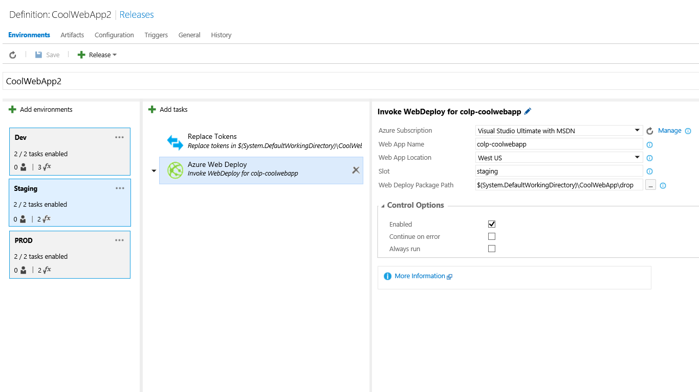

# Colin's ALM Corner Build Tasks - Azure Web Deploy
## DEPRECATED
> The [Azure RM WebApp Deploy Task](https://github.com/Microsoft/vsts-tasks/tree/master/Tasks/AzureRmWebAppDeployment) now does everything this task does, so I'm deprecating this task.

## Overview
This task invokes Web Deploy to Azure. Use this Task over the [Azure Web App Deployment](http://go.microsoft.com/fwlink/?LinkID=613750)
when you want to use tokens in the SetParameters.xml file.

## Settings
The task requires the following settings:

1. **Endpoint**: An Azure Service Endpoint. This should be to the subscription that contains your Web App.
2. **Web App Name**: Name of the Web App in Azure.
3. **Web App Location**: The Azure location that the Web App is in.
4. **Slot (Optional)**: The name of the slot that you are publishing the Web App to. Leave empty for no slot.
5. **Package Path**: The path to the folder containing the webdeploy zip file, cmd file and SetParameters.xml file.

## Token Replacement
You should use the [Replace Tokens](..\ReplaceTokens\README.md) task in order to perform token replacement prior to this task. For more information,
see this [blog post](http://colinsalmcorner.com/post/webdeploy-configs-and-web-release-management).
