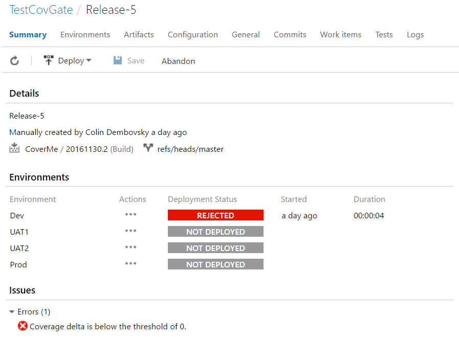
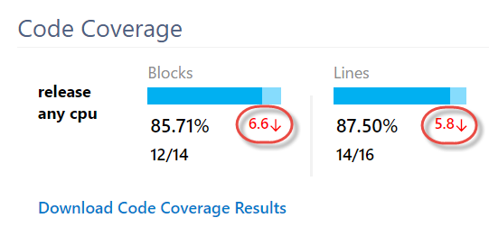
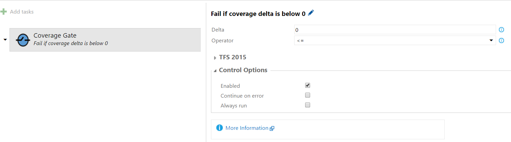

# Colin's ALM Corner Build Tasks - Coverage Gate

## Overview
This task allows you to fail a build/release if the build coverage delta is below a defined threshold.

The build coverage delta is the delta between the coverage percentage of "this" build compared to the
previous successful build. If the delta is negative, coverage is less. You can see the coverage delta
in the build report under the `Coverage` section:

When applying this task to a release, the release gets the build linked to the release and calculates
the delta from the previous build (using the VSTS/TFS API). It then compares the delta to the threshold
setting for the task.

To stop (fail) a release if the coverage has not incremented (improved), simply set the threshold to 0
and set the operator to `<=`. If you want to just enforce that the coverage has not decreased, then set
the threshold to 0 and the operator to `<`. You can of course use other values if you choose to.

## Authentication
This task will try to use the OAuth token from the build/release. You must enable this option in the 
build/release options. For VSTS/TFS builds, this setting is in the options page.

For VSTS releases, this is set on the release agent settings for each environment. For TFS 2015 Update 3,
unfortunately this switch is not available on releases and you cannot create a PAT, so you'll have to 
enter a username/password for the task in the `TFS 2015` section. (Please be responsible and use a secret
for the password!)