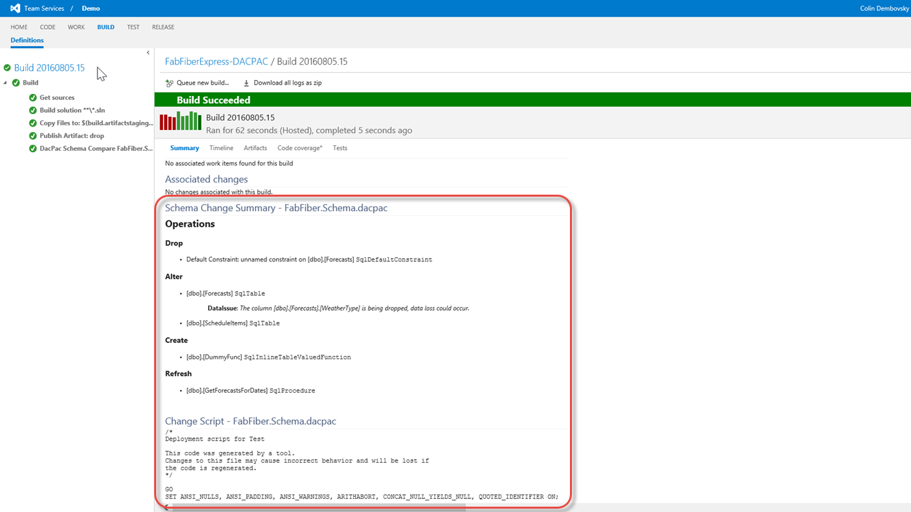

# Colin's ALM Corner Build Tasks - DacPac Change Report

## Overview
This task shows the schema changes of a DacPac between builds. The task adds two sections to the build summary:
1. **Schema Change Summary**: A summary of changes from the last build.
1. **Change Script**: The SQL-CMD script that would be generated if deploying from the newer dacpac model against the older model.

## Settings
The task requires the following settings:

1. **Drop Name**: The drop name of the build that contains the dacpac file. You must publish the dacpac for this task to work.
1. **DacPac Name**: Name of the DacPac to analyze (without .dacpac extension).
1. **Comopiled DacPac Path**: Path to the DacPac file that this build will produce. Typically the `bin\$(BuildConfiguration)` path of the SSDT project.

## OAuth Token
You must enable `Allow Scripts to Access OAuth Token` on the build Options. If you do not, you will see 403 errors.