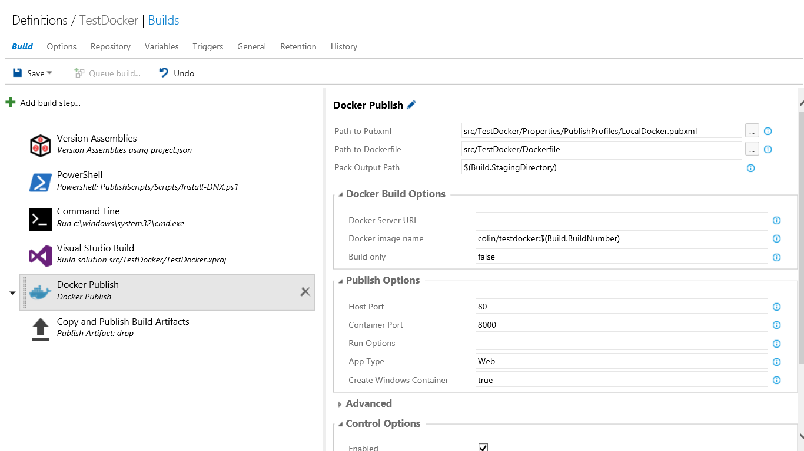

# Colin's ALM Corner Build Tasks - Docker Publish
## DEPRECATED
> The [Docker Integration Extension](https://marketplace.visualstudio.com/items?itemName=ms-vscs-rm.docker) is finally fully featured, so I'm deprecating this task.

## Overview
This task deploys code to a docker image (and optionally runs a container). You can use a pubxml generated by [VS Tools for Docker](https://visualstudiogallery.msdn.microsoft.com/0f5b2caa-ea00-41c8-b8a2-058c7da0b3e4) or just supply all the settings manually.

## Settings
The task has the following settings:

1. **Path to Pubxml file**: path in the repo to the pubxml file (optional)
2. **Path to Dockerfile**: (required) path to the Dockerfile
3. **Pack Output Path**: (required) path to the root of the files you want to deploy to the container
4. **Docker Server Url**: url of your docker host
5. **Docker image name**: name of the image to build
6. **Build Only**: true to just run "docker build": false if you want to execute "docker run" after building
7. **Host port**: the port to open on the host
5. **Container port**: the port to open on the container
8. **Run options**: additional arguments passed to the "docker run" command
9. **App Type**: can be empty or "Web". Only required for ASP.NET applications (sets the _server.urls_ setting)
10. **Create Windows Container**: set to "true" if you're targeting a Windows docker host
11. **Auth Options**: additional arguments to supply to docker commands (for example --tlscert)
12. **Remove Conflicting Containers**: removes containers currently running on the same port when set to "true"

## Details
For a more detailed look at this task (and how to use it for ASP.NET 5 applications) read [this post](http://colinsalmcorner.com/post/continuous-deployment-with-docker-and-build-vnext).
