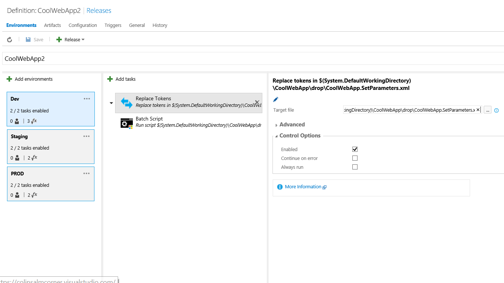

# Colin's ALM Corner Build Tasks - Replace Tokens



## Overview
This task invokes replaces tokens in a file with values from the matching varialbes set in the Environment.

## Settings
The task requires the following settings:

1. **Target File**: path to the file that contains the tokens.
1. **Token Regex**: a RegEx to find the tokens. Must include a group selector. This defaults to `__(\w+)__`. This
will match tokens that have double-underscore `__` prefix and postfix (e.g. `__MyVar__`).

## Environment Variables
The environment variables should use the name of the token without the token identifiers. They can be
defined in the Release (global - applies to all Environments) or in an Environment (in the variables
set for the Environment).

## Example:
Imagine you have a file with the following contents:
```
<?xml version="1.0" encoding="utf-8"?>
<parameters>
  <setParameter name="IIS Web Application Name" value="__SiteName__" />
</parameters>  
```

This file contains a token called "SiteName".

Drop the Task into the build or release, and then set the Target File to the path where the file is. Then set
a global variable or an environment variable called "SiteName" and give it the value you want the token to be
replaced with. That's it!

## Different Token Identifiers
If your tokens have a different identifier, then you can change the Token Regex. For example, if your tokens
are of the form `[[Token]]`, then you can change the Regex to `[[(\w+)]]` and the task will work.

## Gotchas
1. Existing environment variables.

    Be aware that there may be some existing environment variables on the build/release agent. For example
`Username` is set to the identity that the agent is running under. In order to avoid conflicts, you should
ensure that any tokens have a unique name. `WebUsername` is a better token than `Username` for this reason.

1. Secrets

    Secrets are not set as environment variables. You have to defined them explicitly to scripts and tasks.
That means that if you wish to set secret values, you will need to do so outside of this task.