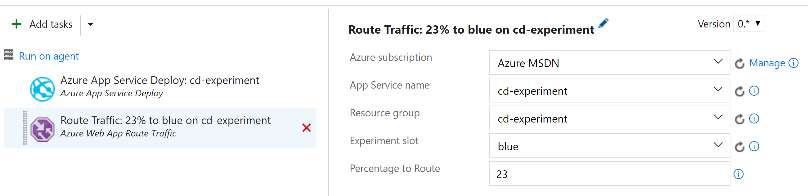

# Colin's ALM Corner Build Tasks - Site Experiment

## Overview
This task routes a specified percentage of traffic to an Azure Web App Slot.

## Settings
The task requires the following settings:

1. **Azure subscription**: An Azure Resource Management subscription endpoint.
1. **App Service name**: The name of the App Service.
1. **Resource group**: The resource group that contains the App Service.
1. **Experiment slot**: The slot to direct a percentage of traffic to.
1. **Percentage to Route**: Tags to add to the build. Can be multi-line for multiple tags.

## Using this task for Hypothesis-driven Development
You can see an example of how to use this task at this [blog post](http://bit.ly/routetraf).