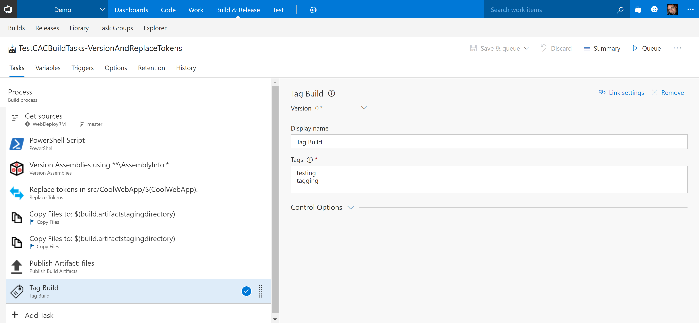
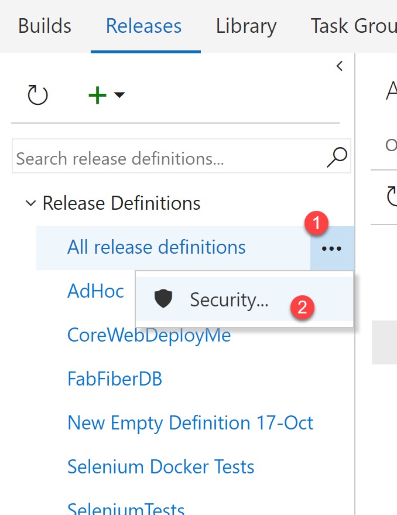

# Colin's ALM Corner Build Tasks - Tag Build



## Overview
This task tags a build/release with the tags specified.

## Settings
The task requires the following settings:

1. **Type**: Build or Release (see below for explanation).
1. **Tags**: Tags to add to the build. Can be multi-line for multiple tags.

## Permissions for Tagging Releases
In order to tag releases, the build service identity needs `Manage Releases` permissions. If the permissions are not set the task will fail with this error:

```
VS402904: Access denied: User Project Collection Build Service does not have manage releases permission. Contact your release manager.
```

You can set the permission as follows:
1. Click on the ellipses on the `All release definitions` node in the Release explorer and click `Security`.
    
1. Click on the `Project Collection Build Service` and set `Manage Releases` to `Allow`.
    

## Tagging Types Matrix

| Definition Type | Tag Type | Notes |
| --- | --- | ------ |
| Build | Build | Tags the current build with the tags |
| Build | Release | Throws an error |
| Release | Release | Tags the current release with the tags |
| Release | Build | Tags the primary build artifact's build with the tags |