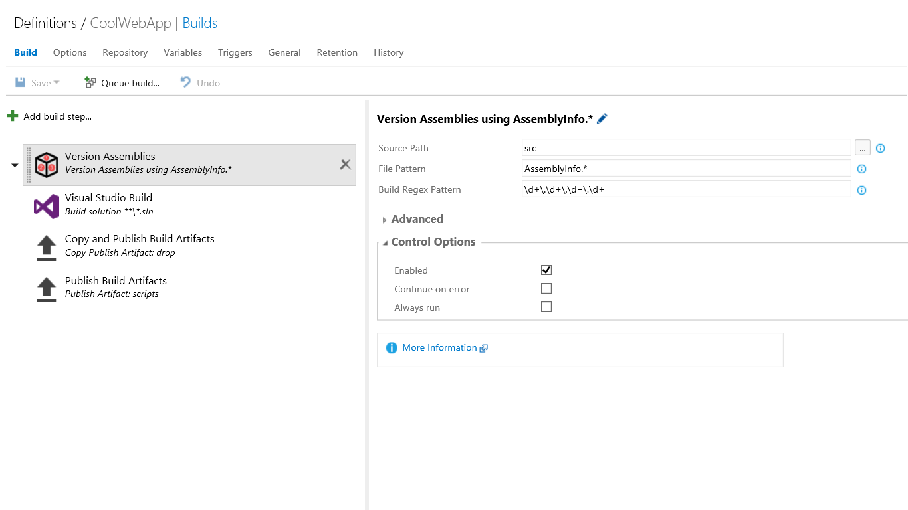

# Colin's ALM Corner Build Tasks - Version Assemblies



## Overview
This task versions assemblies so that the assembly version matches the version portion of the build number.

## Settings
The task requires the following settings:

1. **Source Path**: path to the sources that contain the version number files (such as AssemblyInfo.cs).
1. **File Pattern**: file pattern to search for within the `Source Path`. Defaults to "AssemblyInfo.*"
1. **Build Regex Pattern**: Regex pattern to apply to the build number in order to extract a version number. Defaults to `\d+\.\d+\.\d+\.\d+`.

## Advanced Settings
The following settings are optional and are used for advanced scenarios:

1. **Build Regex Group Index**: Use this if the Build Regex Pattern has groups to index the group that you want to use as the version number.
1. **Regex Replace Pattern**: Use this if the regex to search for in the target files is different from the Build Regex Pattern.
1. **Prefix for Replacements**: Use this if you want to prefix the replacement value with a string.
1. **Fail If No Target Match Found**: Use this to fail the task if there are no matches in the target file using the replacement regex.

## Using the Task
The task should be inserted before any build tasks.

Also, you must customize the build number format (on the General tab of the build definition) in order to specify a format in such a way that the `Build Regex Pattern` can extract a build number from it. For example, if the build number is `1.0.0$(rev:.r)`, then you can use the regex `\d+\.\d+\.\d+\.\d+` to extract the version number.

If you're just versioning assemblies, then the defaults should work just fine. However, there are some advanced scenarios.

### Android Versioning Example
If you want to version an Android app, then you need to change the version code in the AndroidManifest.xml file. The file looks something like
this:

```xml
<?xml version="1.0" encoding="utf-8"?>
<manifest xmlns:android="http://schemas.android.com/apk/res/android" package="myHealth.Client.Droid" android:versionCode="1" android:versionName="1.0" android:installLocation="auto">
	<uses-sdk android:minSdkVersion="15" />
	<application android:label="Patients" android:icon="@drawable/ic_launcher" android:theme="@style/AppTheme" android:hardwareAccelerated="true"></application>
	<uses-permission android:name="android.permission.INTERNET" />
</manifest>
```

In order to replace the version code correctly, you should use the following settings:

1. **Build Regex Pattern**: `(?:\d+\.\d+\.\d+\.)(\d+)` - this extracts the last digit from the build number.
1. **Source Group Index**: `1` - selects the correct matching group (the last digit) instead of the entire match
1. **Regex Replace Pattern**: `versionCode="\d+` - searches for the `versionCode` setting in the file
1. **Prefix for Replacements**: `versionCode="` reinserts the correct prefix during the replacement
